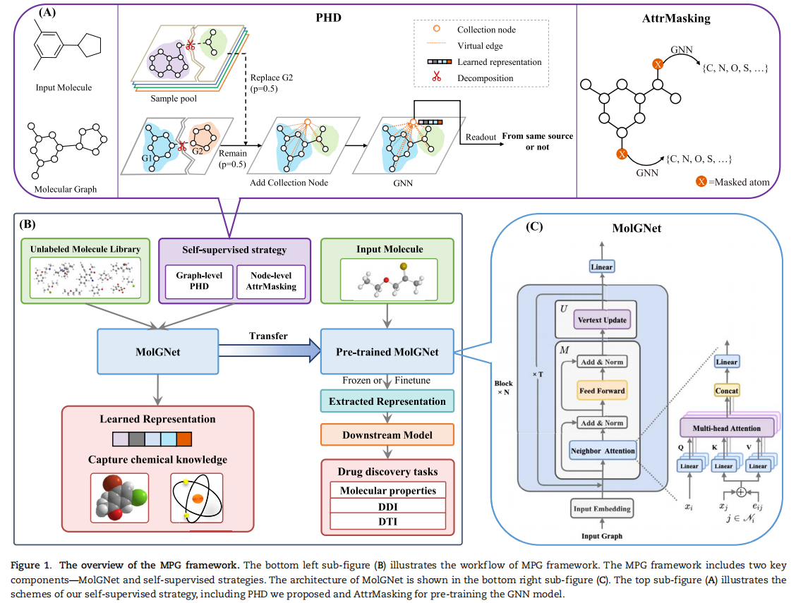

# An effective self-supervised framework for learning expressive molecular global representations to drug discovery

This repository is the official implementation of Our Paper Published on BIB.

> 📋 We provide the code of MPG implementation for pre-training, and fine-tuning on downstream tasks including molecular properties, DDI, and DTI predictions.




## Requirements

To install requirements:

```setup
pip install -r requirements.txt
```

## Pre-training 

To pre-train the model from scrach, please run the following command to preprocess the data by PSD and AttrMasking:
```train
python pretraining/loader.py 
```
Then, run:
```train
bash pretraining/run_pretraining.sh
```
> 📋 Here, we provide an input example of unlabelled molecular data at `data/pretraining/raw/little_set_smi`. To train the model on 11 M molecules thoroughly, 
please download the [complete pre-training dataset](https://drive.google.com/file/d/1Qdf64BnrUK6RjEuNwzhRMdj6lT-QzZYc/view?usp=sharing) first and put it in the `data/pretraining/raw/` folder.
>

## Fine-tune
> 📋 To finetune the model, please download the pretrained models first and put the model in the `pretrained_model/` folder.

### Results

|                          Methods                          	| Classification (AUC-ROC) 	|                        	|                        	|                        	|                        	|                        	|    Regression (RMSE)   	|                        	|                        	|
|:---------------------------------------------------------:	|:------------------------:	|:----------------------:	|:----------------------:	|:----------------------:	|:----------------------:	|:----------------------:	|:----------------------:	|:----------------------:	|:----------------------:	|
|                          Dataset                          	|          Tox21        	|        ToxCast     	|         SIDER        	|        ClinTox       	|         BACE         	|         BBBP         	|       FreeSolv      	|         ESOL         	|         Lipo        	|
|                        \# Molecules                       	|          7831         	|         8575         	|         1427         	|         1478         	|         1513         	|         2039         	|          642         	|         1128        	|         4200        	|
|              ECFP                	|    $0.760_{(0.009)}$   	|    $0.615_{(0.017)}$   	|    $0.630_{(0.019)}$   	|    $0.673_{(0.031)}$   	|    $0.861_{(0.024)}$   	|    $0.783_{(0.050)}$   	|   $5.275 _{(0.751)}$   	|   $2.359 _{(0.454)}$   	|   $1.188 _{(0.061)}$   	|
|          TF\_Robust          	|    $0.698_{(0.012)}$  	|    $0.585_{(0.031)}$   	|    $0.607_{(0.033)}$   	|    $0.765_{(0.085)}$   	|    $0.824_{(0.022)}$   	|    $0.860_{(0.087)}$   	|   $4.122 _{(0.085)}$   	|   $1.722 _{(0.038)}$   	|   $0.909 _{(0.060)}$   	|
|               GraphConv                	|    $0.772_{(0.041)}$  	|    $0.650_{(0.025)}$   	|    $0.593_{(0.035)}$   	|    $0.845_{(0.051)}$   	|    $0.854_{(0.011)}$   	|    $0.877_{(0.036)}$   	|    $2.900_{(0.135)}$   	|    $1.068_{(0.050)}$   	|    $0.712_{(0.049)}$   	|
|             Weave              	|    $0.741_{(0.044)}$  	|    $0.678_{(0.024)}$   	|    $0.543_{(0.034)}$   	|    $0.823_{(0.023)}$   	|    $0.791_{(0.008)}$   	|    $0.837_{(0.065)}$   	|    $2.398_{(0.250)}$   	|    $1.158_{(0.055)}$   	|    $0.813_{(0.042)}$   	|
|               SchNet               	|    $0.767_{(0.025)}$  	|    $0.679_{(0.021)}$   	|    $0.545_{(0.038)}$   	|    $0.717_{(0.042)}$   	|    $0.750_{(0.033)}$   	|    $0.847_{(0.024)}$   	|    $3.215_{(0.755)}$   	|    $1.045_{(0.064)}$   	|    $0.909_{(0.098)}$   	|
|               MPNN                	|    $0.808_{(0.024)}$   	|    $0.691_{(0.013)}$   	|    $0.595_{(0.030)}$   	|    $0.879_{(0.054)}$   	|    $0.815_{(0.044)}$   	|    $0.913_{(0.041)}$   	|    $2.185_{(0.952)}$   	|    $1.167_{(0.430)}$   	|    $0.672_{(0.051)}$   	|
|               DMPNN               	|   $0.826_{(0.023)}$   	|    $0.718_{(0.011)}$   	|    $0.632_{(0.023)}$   	|    $0.897_{(0.040)}$   	|    $0.852_{(0.053)}$   	|    $0.919_{(0.030)}$   	|    $2.177_{(0.914)}$   	|    $0.980_{(0.258)}$   	|    $0.653_{(0.046)}$   	|
|                MGCN                 	|    $0.707_{(0.016)}$   	|    $0.663_{(0.009)}$   	|    $0.552_{(0.018)}$   	|    $0.634_{(0.042)}$   	|    $0.734_{(0.030)}$   	|    $0.850_{(0.064)}$   	|    $3.349_{(0.097)}$   	|    $1.266_{(0.147)}$   	|    $1.113_{(0.041)}$   	|
|            AttentiveFP             	|    $0.807_{(0.020)}$   	|    $0.579_{(0.001)}$   	|    $0.605_{(0.060)}$   	|    $0.933_{(0.020)}$   	|    $0.863_{(0.015)}$   	|    $0.908_{(0.050)}$   	|    $2.030_{(0.420)}$   	|    $0.853_{(0.060)}$   	|    $0.650_{(0.030)}$   	|
|                TrimNet                	|    $0.812_{(0.019)}$   	|    $0.652_{(0.032)}$   	|    $0.606_{(0.006)}$   	|    $0.906_{(0.017)}$   	|    $0.843_{(0.025)}$   	|    $0.892_{(0.025)}$   	|    $2.529_{(0.111)}$   	|    $1.282_{(0.029)}$   	|    $0.702_{(0.008)}$   	|
|  Mol2Vec   	|    $0.805_{(0.015)}$   	|    $0.690_{(0.014)}$   	|    $0.601_{(0.023)}$   	|    $0.828_{(0.023)}$   	|    $0.841_{(0.052)}$   	|    $0.876_{(0.030)}$   	|   $5.752 _{(1.245)}$   	|   $2.358 _{(0.452)}$   	|   $1.178 _{(0.054)}$   	|
|        N-GRAM         	|    $0.769_{(0.027)}$  	|            -           	|    $0.632_{(0.005)}$   	|    $0.855_{(0.037)}$   	|    $0.876_{(0.035)}$   	|    $0.912_{(0.013)}$   	|    $2.512_{(0.190)}$   	|    $1.100_{(0.160)}$   	|    $0.876_{(0.033)}$   	|
|  SMILES-BERT  	|    $0.803_{(0.010)}$  	|    $0.655_{(0.010)}$   	|    $0.568_{(0.031)}$   	| **${0.985}_{(0.014)}$** 	|    $0.849_{(0.021)}$   	| **${0.959}_{(0.009)}$** 	|   ${2.974}_{(0.510)}$  	|   ${0.841}_{(0.096)}$  	|   ${0.666}_{(0.029)}$  	|
|  HU. et.al.  	|    $0.811_{(0.015)}$   	|    $0.714_{(0.019)}$   	|    $0.614_{(0.006)}$   	|    $0.762_{(0.058)}$   	|    $0.851_{(0.027)}$   	|    $0.915_{(0.040)}$   	|            -           	|            -           	|            -           	|
|     GROVER    	|   ${0.831}_{(0.025)}$	|   ${0.737}_{(0.010)}$  	|   ${0.658}_{(0.023)}$  	|   ${0.944}_{(0.021)}$  	|   ${0.894}_{(0.028)}$  	|    $0.940_{(0.019)}$   	|   ${1.544}_{(0.397)}$  	|   ${0.831}_{(0.120)}$  	|    $0.560_{(0.035)}$   	|
|                  MPG(ours)                 	| **${0.837}_{(0.019)}$** 	| **${0.748}_{(0.005)}$** 	| **${0.661}_{(0.007)}$** 	|    $0.963_{(0.028)}$   	| **${0.920}_{(0.013)}$** 	|    $0.922{(0.012)}$    	| **${1.269}_{(0.192)}$** 	| **${0.741}_{(0.017)}$** 	| **${0.556}_{(0.017)}$** 	|

### To fine-tune on molecular propertied prediction, please run:
**Classification tasks**
```finetune
python property/finetune.py --dataset toxcast --lr 0.0001 --input_model_file pretrained_model/MolGNet.pt
```
Note: If you want to run the fine-tune on CPU, please add an argument ```--cpu``` to the command above.
There are more hyper-parameters which can be tuned during finetuning. Please refer to the arguments in ```finetune.py```.

**Regression tasks**
```finetune
python property/finetune_regress.py --dataset esol --lr 0.0001 --input_model_file pretrained_model/MolGNet.pt
```
### To fine-tune on DDI prediction, please run:
**BIOSNAP**
```finetune
python DDI/finetune_snap.py --input_model_file pretrained_model/MolGNet.pt
```
**TWOSIDES**
```finetune
python DDI/finetune_twosides.py --input_model_file pretrained_model/MolGNet.pt
```
### To fine-tune on DDI prediction, please run:
```finetune
python CPI/cross_validate.py --dataset human --input_model_file pretrained_model/MolGNet.pt
```

## Evaluation for reproductivity
Due to the non-deterministic behavior of the function index_select_nd(See [link](https://pytorch.org/docs/stable/notes/randomness.html)) and the randomless of dataset split,
it is hard to exactly reproduce the training process of finetuning. Therefore, we provide the finetuned model and the splitted datasets
for thirteen datasets to guarantee the reproducibility of the experiments. Note: these results are fine-tuned in different hardware environments, resulting in slightly difference from reported statistics in the paper.

**Molecular property prediction**
- [BBBP](https://drive.google.com/drive/folders/1m95c_6F3Df5VzWGgH4k1jjR3NqwXjhj3) 
- [SIDER](https://drive.google.com/drive/folders/1m95c_6F3Df5VzWGgH4k1jjR3NqwXjhj3) 
- [ClinTox](https://drive.google.com/drive/folders/1m95c_6F3Df5VzWGgH4k1jjR3NqwXjhj3) 
- [BACE](https://drive.google.com/drive/folders/1m95c_6F3Df5VzWGgH4k1jjR3NqwXjhj3) 
- [Tox21](https://drive.google.com/drive/folders/1m95c_6F3Df5VzWGgH4k1jjR3NqwXjhj3) 
- [ToxCast](https://drive.google.com/drive/folders/1m95c_6F3Df5VzWGgH4k1jjR3NqwXjhj3) 
- [FreeSolv](https://drive.google.com/drive/folders/1m95c_6F3Df5VzWGgH4k1jjR3NqwXjhj3) 
- [ESOL](https://drive.google.com/drive/folders/1m95c_6F3Df5VzWGgH4k1jjR3NqwXjhj3) 
- [Lipo](https://drive.google.com/drive/folders/1m95c_6F3Df5VzWGgH4k1jjR3NqwXjhj3) 

**DDI prediction**
- [TWOSIDES](https://drive.google.com/drive/folders/19ZkpTnHuxygi4N37kajOcJu5U7OBtMAU) 
- [BIOSNAP](https://drive.google.com/drive/folders/19ZkpTnHuxygi4N37kajOcJu5U7OBtMAU) 

**DTI prediction**
- [human](https://drive.google.com/drive/folders/1S3VLYESORwXLL5q12sAcWy8skEYz59kl) 
- [*elegans*](https://drive.google.com/drive/folders/1S3VLYESORwXLL5q12sAcWy8skEYz59kl) 

We provide the `eval.py` function in `property`, `DDI` and `DTI` folders to reproduce the experiments. 
For example, to evaluate the performance on BBBP dataset, suppose the finetuned model is placed in `finetuned_model/`, please run:
```
python property/eval.py --dataset bbbp --model_dir finetuned_model/property
```
## Citation

Please cite our paper if you find this code useful for your research:

```
@article{li2021effective,
  title={An effective self-supervised framework for learning expressive molecular global representations to drug discovery},
  author={Li, Pengyong and
          Wang, Jun and
          Qiao, Yixuan and
          Chen, Hao and
          Yu, Yihuan and
          Yao, Xiaojun and
          Gao, Peng and
          Xie, Guotong and
          Song, Sen},
  journal={Briefings in Bioinformatics},
  volume={22},
  number={6},
  pages={bbab109},
  year={2021},
  publisher={Oxford University Press}
}
```
